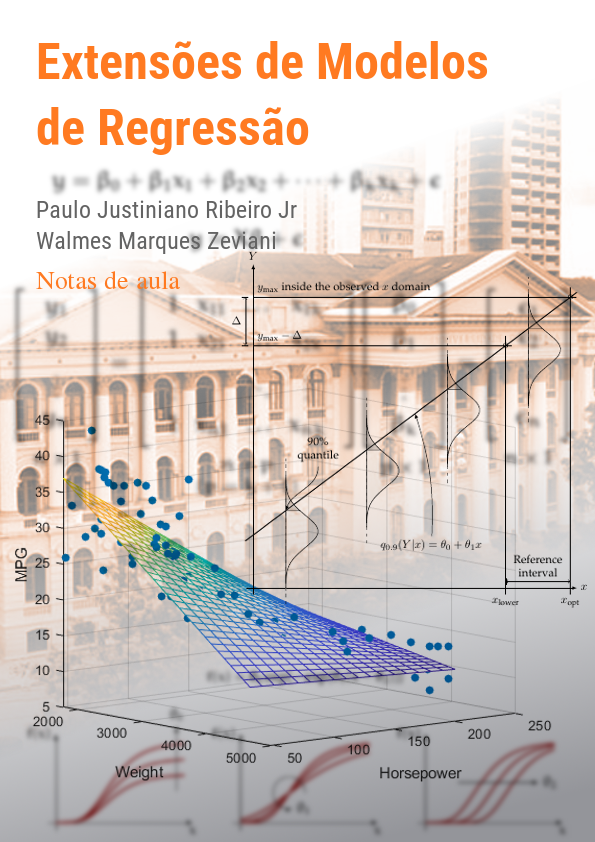

<!-- Imagem de capa. -->
```{r, echo = FALSE, results = "asis", eval = isOutput("html")}
img <- '# {-}\n\n<div></div>'
cat(img, "\n")
```

\

**Atenção**: este material contém notas de aula da disciplina de CE 092
· Extensões de Modelos de Regressão oferecido para o Curso de
Bacharelado em Estatística da UFPR. O material está em contínuo
desenvolvimento. Sugestões, contribuições e críticas são bem vindas.

# Apresentação {-}

```{r, include = FALSE, eval = isOutput("html")}
# Para habilitar Font Awesome no documento.
# https://github.com/rstudio/rmarkdown/issues/813
fa <- rmarkdown::html_dependency_font_awesome()
fa$attachment <- "fonts/fontawesome-webfont.ttf"
htmltools::tagList(fa)
```
